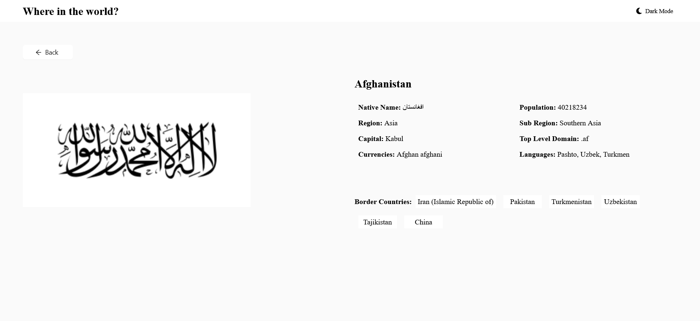

# Frontend Mentor - REST Countries API with color theme switcher solution

This is a solution to the [REST Countries API with color theme switcher challenge on Frontend Mentor](https://www.frontendmentor.io/challenges/rest-countries-api-with-color-theme-switcher-5cacc469fec04111f7b848ca). Frontend Mentor challenges help you improve your coding skills by building realistic projects. 

## Table of contents

- [Overview](#overview)
  - [The challenge](#the-challenge)
  - [Screenshot](#screenshot)
  - [Links](#links)
- [My process](#my-process)
  - [Built with](#built-with)
  - [What I learned](#what-i-learned)
  - [Continued development](#continued-development)
  - [Useful resources](#useful-resources)
- [Author](#author)
- [Acknowledgments](#acknowledgments)

**Note: Delete this note and update the table of contents based on what sections you keep.**

## Overview

### The challenge

Users should be able to:

- See all countries from the API on the homepage
- Search for a country using an `input` field
- Filter countries by region
- Click on a country to see more detailed information on a separate page
- Click through to the border countries on the detail page
- Toggle the color scheme between light and dark mode *(optional)*

### Screenshot





### Links

- Live Site URL: [ World Countries](https://world-countries-tawny.vercel.app/)

## My process

### Built with

- Semantic HTML5 markup
- CSS custom properties
- Flexbox
- CSS Grid
- Mobile-first workflow
- [React](https://reactjs.org/) - JS library

### What I learned

I have used full functional componenets in react and made proxy server to avoid cors issue also to be able to make 
processing in on the images also used Antd compnenets and react router .

```js

  useEffect(() => {
    const fetchData = async () => {
      try {
        const response = await fetch(`/data.json`); // Adjust the path based on your project structure
        const data = await response.json();
  
        // Find the country data by country code
        const country = data.find((c) => c.numericCode === countryCode);
  
        if (country) {
          setCountryData(country);
          let borderCountryDetails ;
          if(country.borders){
          // Fetch details of border countries
           borderCountryDetails = await Promise.all(
            country.borders.map(async (borderCode) => {
              const borderCountry = data.find((c) => c.alpha3Code === borderCode);
              return borderCountry ? borderCountry.name : null;
            })
          );
          }else {
            borderCountryDetails = [];
          }
  
          // Filter out null values (countries not found)
          const validBorderCountryDetails = borderCountryDetails.filter((borderCountry) => borderCountry !== null);
            
          // Set the names of the border countries in state
          setBorderCountryNames(validBorderCountryDetails);

      
        } else {
          console.error('Country not found.');
        }
        const Imgresponse = await axios.post('https://world-countries-api-nine.vercel.app/process-image', { url: country.flags.png }, { responseType: 'arraybuffer' });
 
        // Convert binary data to Uint8Array
    const uint8Array = new Uint8Array(Imgresponse.data);

    // Create a Blob from the Uint8Array
    const blob = new Blob([uint8Array], { type: 'image/png' });

    // Create a data URL from the Blob
    const dataUrl = URL.createObjectURL(blob);
      
      setProcessedImage(`${dataUrl}`);
      setIsLoading(false);
      } catch (error) {
        console.error('Error fetching country data:', error);
      }
    };

    fetchData();

  }, [countryCode]);
   
  if (!countryData) {
    return (   
      <div style={centerStyle}>
      <Spin style={centerStyle} tip="" size="large">
        <div style={centerStyle} className="content" />
      </Spin>
    </div>
  )}
```

### Continued development

In the future i may add more information and provide link for postion on maps or link to wiki page or images for most 
important places or persons in it's history .

## Author

- Website - [Abdulrahman Badr](https://www.linkedin.com/in/abdulrahmanbadr99/)
- Frontend Mentor - [@abdulrahman9901](https://www.frontendmentor.io/profile/abdulrahman9901)
- Twitter - [@Abdulrahman_Bdr](https://twitter.com/Abdulrahman_Bdr)
